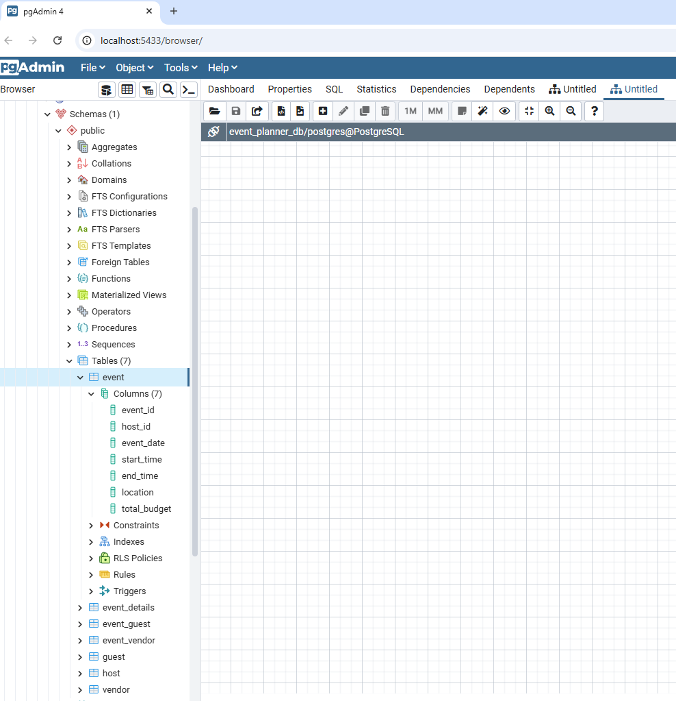
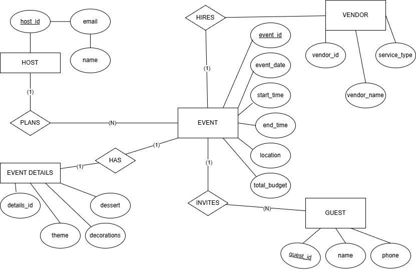

# Event Planner API

## Description

This project is a REST API built using Flask and PostgreSQL.  
It allows users to manage events, hosts, guests, and vendors.
I used Flask to create the API routes and SQLAlchemy to connect to the database.  
I tested all endpoints using Insomnia.

---

## Base URL / Insomnia 
This API runs locally on my machine:
http://127.0.0.1:5000
(Note: This URL only works when the server is running locally.)

---

## API Reference

### Events

| Method | Endpoint        | Description                  |
|--------|----------------|------------------------------|
| GET    | /events        | Get all events               |
| GET    | /events/{id}   | Get one event by ID          |
| POST   | /events        | Create a new event           |
| PUT    | /events/{id}   | Update an event              |

---

### Hosts


| Method | Endpoint        | Description          |
|--------|----------------|----------------------|
| GET    | /hosts         | Get all hosts        |
| GET    | /hosts/{id}    | Get one host         |

---


### Guests

| Method | Endpoint        | Description          |
|--------|----------------|----------------------|
| GET    | /guests        | Get all guests       |

---

### Vendors

| Method | Endpoint        | Description          |
|--------|----------------|----------------------|
| GET    | /vendors       | Get all vendors      |

---

## Example Response (GET /events)

```json

[

  {

    "event_id": 1,
    "event_date": "2026-10-31",
    "start_time": "19:00:00",
    "end_time": "23:00:00",
    "location": "Riverfront Events",
    "total_budget": 6000

  }

]
```


To make my database faster, I added an index to the event table:
CREATE INDEX idx_event_host_id ON event(host_id);
An index helps the database find data faster, especially when searching by a specific column like host_id.

After adding the index, I tested my API using Insomnia. I checked routes like GET /events and GET /hosts, and everything worked correctly. All requests returned successful responses (200 OK).


Retrospective
1. How did the project change over time?

At the beginning, I focused on designing the database and tables.
Later, I built the API routes using Flask.
At first, I had issues with routes and database connection errors, but I fixed them step by step.
By the end, everything worked together, and I was able to test all endpoints using Insomnia.

2. Did you use an ORM or raw SQL?

I used an ORM (SQLAlchemy).
It made it easier to work with the database using Python instead of writing SQL queries manually.

3. What would you improve in the future?

In the future, I would:
Add authentication (login system)
Add more validation for user input
Improve error messages
Deploy the API so others can use it online

## Tools Used
-Python
-Flask
-PostgreSQL
-SQLAlchemy
-Insomnia (used for testing API endpoints)

## Database Diagram




#

